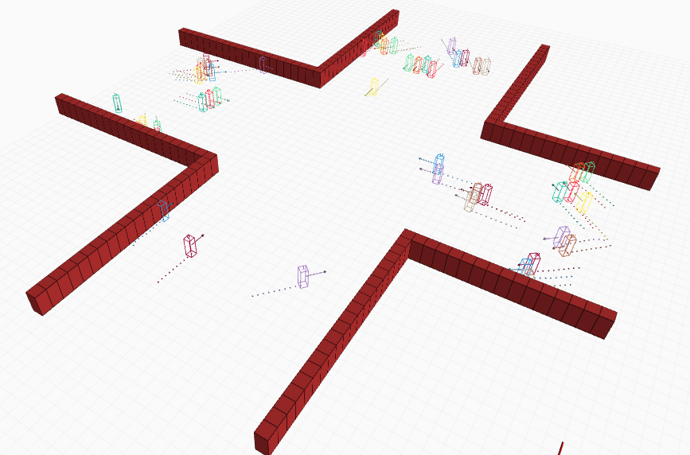
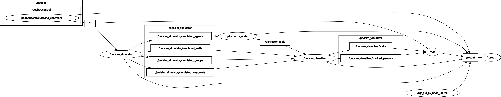

# Pedestrian Simulator (Pedsim_ROS) - Distracted Node

This repository presents the library "Pedestrian Simulator (Pedsim_ROS) - Distracted Node" for a pedestrians simulator with distracted behavior based on the [Pedsim_ROS](https://github.com/srl-freiburg/pedsim_ros) library which is also based on social force
model of [Helbing et. al](http://arxiv.org/pdf/cond-mat/9805244.pdf) and predictive collision avoidance model of [Karamouzas et. al](https://cdef6307-a-62cb3a1a-s-sites.googlegroups.com/site/ikaramouzas/publications/mig09.pdf?attachauth=ANoY7cobMHWBC3L8HB6gys3lZfBxUE1bzaeCH2h28V6j8zvQaPjr6igedCMRpoHdX2aOkeBJm3pg0nSxgUi2jKVvy_K1zMND_3UyMvSx1bpTiNc30u8B6020Qw43mvMKJaD1vG30AvTykZH3MgT9T1hMecr5STZmGw5tQ4ziNP7PRth2_HMZKDOnyaFYCHg7U1mbUVGO7cUEnZ2gqvnACd5fghO0NSm1RqocaEnju4X7XsOKuPqmSEk%3D&attredirects=0). The implementation of the library is based on the addition of nodes and distractor topics to show different behaviors of the agents.
<p align="center">

</p>

### Features
- Distracted nodes and topics for distracted behaviour in agents

### Requirements
- ROS with the visualization stack (currently tested on `noetic` )
- C++11 compiler
- Python 2.8+

### Installation

```
cd [workspace]/src
git clone https://github.com/npulidog/pedsim_ros_distracted_node.git
cd pedsim_ros_distracted_node
git submodule update --init --recursive
cd ../..
catkin build -c  # or catkin_make
```
### Sample usage
```
roslaunch pedsim_simulator Pasillo.launch
```
```
roslaunch pedsim_simulator cruz.launch
```
### ROS Computation Graph (rqt_graph)
<p align="center">

</p>

### Developers
* Nicolas Pulido Gerena
* Camilo Ernesto Campo Pacheco


### Contributors
* Juan Sebastian Hernandez Reyes
* Jose Manuel Fajardo Dueñas

The package is a **work in progress** mainly used in research prototyping. Pull requests and/or issues are highly encouraged.

### Acknowledgements
These packages have been developed during our degree work (2022)
